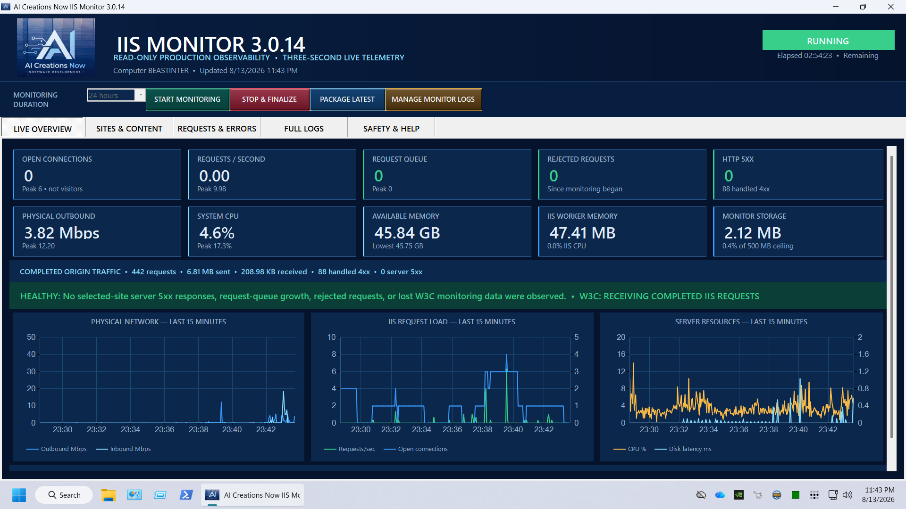

  

<h1 align="center">IIS Monitor</h1>

**A Windows dashboard for Microsoft IIS activity and server health.** IIS Monitor from AI Creations Now Software Development brings selected-site traffic, bandwidth, downloads, HTTP errors, connections and system resources into one view.

  <a href="https://aicreatenow.com/IISMonitor.html">Product page and purchase</a>

  

## Features

- Choose which discovered IIS websites to include in a monitoring session.
- View dashboard updates every three seconds, including server resources and selected-site activity.
- Review website, content, download and HTTP-error tables with plain-language health summaries.
- Retain detailed CSV, TXT and JSON reports, and package a session as a ZIP.
- Monitor without changing IIS sites, application pools, bindings, firewall rules or official IIS logs.

## Requirements and setup

Use a Windows x64 computer with Microsoft IIS and compatible Windows components and logging settings. Request the **IIS Compatibility Tester** before purchasing to check your system.

IIS Monitor is a portable desktop application. Activate it using the supplied 10-digit code and complete the first online verification, select your sites, then start monitoring. Stop the session cleanly before reviewing or packaging its final reports.

The dashboard measures activity that reaches the IIS server. Content served entirely from Cloudflare's cache does not reach IIS and is not included. Connection counts are not visitor counts, and completed requests appear after IIS finishes processing them.

## License, delivery and support

**$29.99 one-time payment** buys a lifetime license for one computer, with lifetime software upgrades, customer support and the IIS Compatibility Tester. No subscription is required.

[Buy through the official product page](https://aicreatenow.com/IISMonitor.html). The software, 10-digit license code and Compatibility Tester are emailed to the checkout address within one hour.

For a pre-purchase compatibility check, email [info@aicreatenow.com](mailto:info@aicreatenow.com?subject=IIS%20Monitor%20Compatibility%20Tester%20Request). For support or delivery help, use the same email address or call **1-866-315-4750**.

See [support information](SUPPORT.md) for what to include when requesting help.

## Practical guide and release notes

[Getting started and common questions](GETTING-STARTED.md) · [GitHub release notes](https://github.com/aicreatenowdom/iis-monitor/releases) · [Support](SUPPORT.md)

GitHub's **Code → Download ZIP** contains this repository's documentation and artwork. Get the Windows application through the [official product page](https://aicreatenow.com/IISMonitor.html).

## Source and licensing

This repository contains documentation for proprietary software. Application source code is not included. Obtain the application and its applicable terms through the official product page.

---

Developed by [AI Creations Now Software Development](https://github.com/aicreatenowdom) · [Official software catalog](https://aicreatenow.com/software.html)
